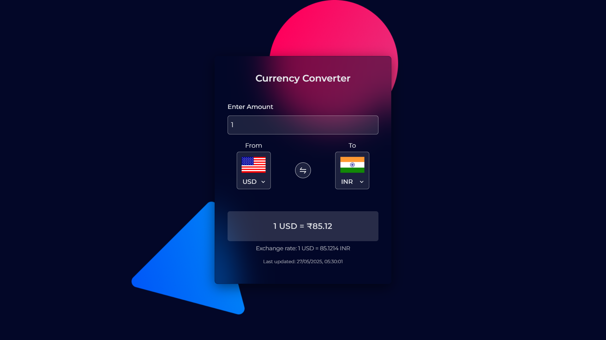
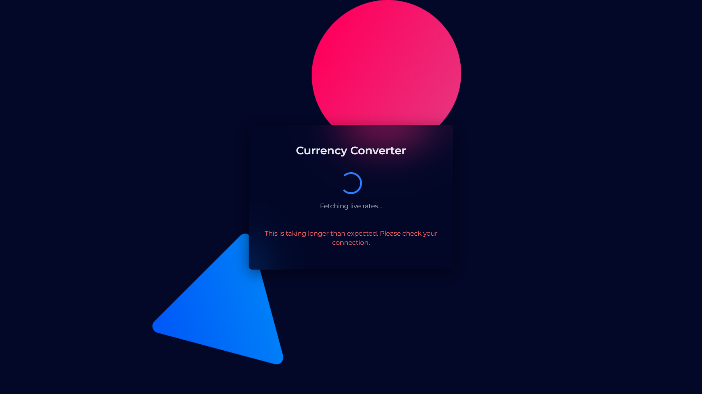

# 💱 Currency Converter

A modern and responsive currency converter built with **React**, powered by the [ExchangeRate-API](https://www.exchangerate-api.com/), and deployed using **Netlify**.

This project showcases best practices in frontend development including API integration, user experience design, asynchronous data handling, localStorage caching, error recovery flows, and production-grade deployment with environment variables.

[🌍 View Live Demo](https://getexchangerate.netlify.app/)

---

## ⚙️ Features

- 🔄 Real-time exchange rates via a live API
- 🌐 Convert between any two currencies
- ⚙️ **Custom React hooks** for data fetching
- 💽 Caching with `localStorage` to reduce unnecessary API calls
- 🚧 Graceful error handling and **retry mechanism**
- ⏳ Progress indicator and "slow network" alert
- ⭐️ Toast messages for feedback (`react-toast` style component)
- 🎯 Accessible (ARIA-live support, keyboard navigable)
- 🎨 Styled using Tailwind CSS
- 🔐 Secured API key via **Environment Variables** in Netlify
- 📦 Fully deployed with CI via GitHub + Netlify

---

## 🔍 Why This Project?

While currency converters are commonly used, this version stands out for its **frontend architecture** and **user experience** work:

- Shows how to handle async operations with **loading and failure states**
- Demonstrates **real-world API usage** with performance optimizations
- Brings in **good DevOps practices** (.env management, deployment)
- Highlights resilience through **retry logic** and fetch fallback scenarios

> This app is part of my frontend portfolio and designed to reflect real job workflows—from idea to production.

---

## 🚀 Tech Stack

| Tech         | Purpose                                |
|--------------|----------------------------------------|
| **React**    | UI and state management                |
| **Vite**     | Lightning-fast development environment |
| **Tailwind** | Styling with utility-first CSS         |
| **Netlify**  | Build & deployment platform            |
| **localStorage** | Caching API responses            |

---

## 🧠 Key Concepts Demonstrated

- Custom Hooks: `useCurrencyData()` for fetching and caching data
- Debounced retry with cooldown to prevent API spam
- ARIA roles and progressive UX hints (for slow/failed fetches)
- **Environment-based builds** (local `.env`, Netlify Secrets)
- Clean component architecture (`ConverterForm`, `Spinner`, `Toast`, etc.)

---

## 🔐 Environment Variables

To run this locally, create a `.env` file in your project root:

VITE_EXCHANGE_API_KEY=your-api-key-here

Make sure `.env` is added to `.gitignore` to avoid exposing secrets.

This variable is securely set in Netlify for production builds as well.

---

## 💻 Getting Started

git clone https://github.com/abhishekmishra-code/currency-converter.git

cd currency-converter

npm install

npm run dev

Set up your `.env` file as noted above.

---

## 📸 Screenshots

---

## 🔄 Possible Improvements

This project is a great foundation and can be extended by:

- 📈 Adding historical exchange rate graphs (Chart.js / Recharts)
- 📲 Mobile-first responsive refinements
- 🌙 Theme toggle (dark/light mode)
- 🌍 Currency name search or filter
- i18n / multi-language support
- 🔧 Proxying API through a Netlify Function (to fully hide the key)

---

## 🧠 What I Learned

- How to manage async calls and cache results effectively
- Useful patterns for UX feedback while loading/failing API calls
- Best practices in frontend deployment with environment variables
- How to make small apps feel polished and production-ready

---

## 📫 Contact Me

Looking to connect or collaborate?

👋 Reach out on [LinkedIn](https://linkedin.com/in/your-profile)  
📧 Email: [abhishekmishra@gmail.com](mailto:abhishekmishra0101010@gmail.com)  
🌐 Portfolio: [abhishekmishra.com](https://abhishekmportfolio.netlify.app/)

---

## 📄 License

This project is open-source under the [MIT License](LICENSE).

---

🧑‍💻 Made with ❤️ by **[Abhishek Mishra]**